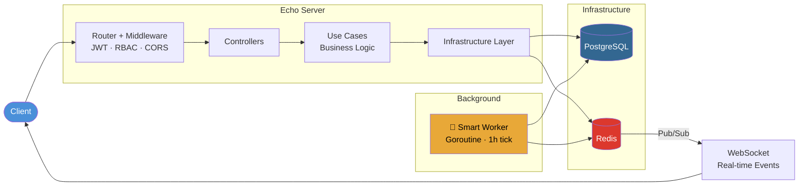
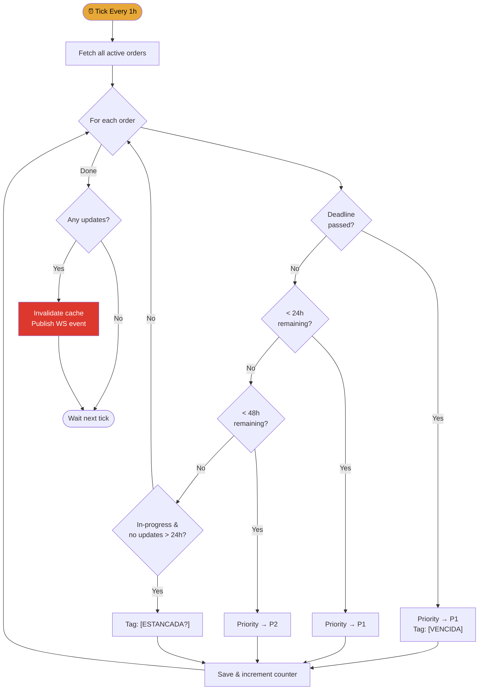

<p align="center">
  <h1 align="center">⚙️ SliceFlow</h1>
  <p align="center">
    <strong>Manufacturing Execution System for 3D Printing Farms</strong>
  </p>
  <p align="center">
    
    
    
    
    
    
  </p>
</p>

---

SliceFlow is a **production-grade REST API** that centralizes operations for 3D printing businesses. It manages the full lifecycle of production orders, material inventory, machine fleet monitoring, and stock movements — with an intelligent background worker that auto-prioritizes tasks based on deadlines.

> 📢 **Includes Swagger UI documentation & Bruno Collection for API testing.**

## ✨ Key Features

- 🧠 **Smart Worker** — Background goroutine that auto-escalates priority (`P1`/`P2`) when deadlines approach (<24h/48h) and flags stalled ("zombie") orders.
- 🔐 **Role-Based Access Control** — JWT authentication with three-tier roles: `owner` → `admin` → `user`. Financial fields (`revenue`, `price`) are automatically censored for non-admin roles.
- 📡 **Real-Time Dashboard** — WebSocket endpoint backed by Redis Pub/Sub pushes live updates to connected clients on order/machine state changes.
- ⚡ **Redis Caching** — High-performance caching layer with pattern-based invalidation for heavy-read endpoints.
- 🏢 **Multi-Tenancy** — All resources are scoped by `CompanyID`, supporting multiple organizations on a single deployment.
- 📦 **Inventory Control** — Full stock management with movement history, material tracking, and pre-validation before order prioritization.

## 🏗️ Architecture

```
Clean Architecture — Request lifecycle
```



## 📁 Project Structure

```
SliceFlow/
├── cmd/
│   └── api/
│       └── main.go              # Entry point, server bootstrap, goroutine init
├── internal/
│   ├── auth/                    # JWT token generation & validation
│   ├── controllers/             # HTTP handlers (Echo) with Swagger annotations
│   │   ├── auth_controller.go
│   │   ├── orders_controller.go
│   │   ├── machine_controller.go
│   │   ├── stock_controller.go
│   │   ├── ws_controller.go     # WebSocket handler (Redis Pub/Sub consumer)
│   │   └── ...
│   ├── middlewares/             # JWT claims extraction & role enforcement
│   ├── routers/                # Route registration & group definitions
│   ├── services/               # Business logic (Use Cases)
│   │   ├── orders/             # Create, Update, Delete, Get, Dashboard
│   │   ├── stock/              # Products & stock movements
│   │   ├── machine/            # Machine fleet management
│   │   ├── material/           # Material catalog (FDM/SLS)
│   │   ├── user/               # User CRUD with soft-delete
│   │   ├── company/            # Multi-tenant company management
│   │   ├── authenticator/      # Login use case
│   │   ├── rutines/            # 🤖 Smart Worker (auto-priority engine)
│   │   └── common/             # Shared: cache invalidation, Pub/Sub events
│   ├── infra/
│   │   ├── database/           # GORM setup, generic CRUD utils, scoped queries
│   │   └── cache/              # Redis client initialization
│   ├── types/                  # Domain models, DTOs, response types
│   └── swagger/                # Swagger UI registration
├── docs/                       # Auto-generated Swagger JSON/YAML
├── docker-compose.yaml         # Full stack: App + PostgreSQL + Redis + pgAdmin
├── dockerfile                  # Multi-stage build (builder → alpine)
└── go.mod
```

## 🧠 Smart Worker — How It Works

The background worker runs as a **goroutine** with a 1-hour tick cycle. It implements two core algorithms:



## 🔐 Auth & Roles

| Role | Capabilities |
|------|-------------|
| `owner` | Full access. Create companies, manage admins, see all data including financials |
| `admin` | Manage users, orders, machines, materials, stock. See prices and revenue |
| `user` | Manage own orders and machines. Financial fields are **automatically zeroed** |

**Flow:**
1. `POST /hornero/auth/login` → Returns JWT token
2. Include `Authorization: Bearer <token>` on all protected endpoints
3. Middleware extracts claims and enforces role permissions per route group

## 🚀 Quick Start

### Prerequisites
- **Go** ≥ 1.21
- **Docker Desktop** (WSL2 on Windows)
- **Git**

### 1. Clone & Configure

```bash
git clone https://github.com/francotraversa/Sliceflow.git
cd Sliceflow
cp .env.example .env.dev
```

Edit `.env.dev`:
```env
PORT=8181
JWT_SECRET=your_secure_secret_here
TTL=1440

POSTGRES_HOST=db
POSTGRES_USER=postgres
POSTGRES_PASSWORD=postgres
POSTGRES_DB=sliceflow_db
POSTGRES_PORT=5432

REDIS_ADDR=redis:6379
```

### 2. Run with Docker

```bash
docker-compose up --build -d
```

The API will be available at `http://localhost:1000`

### 3. Run Locally (without Docker)

```bash
# Set POSTGRES_HOST=localhost in .env.dev
go mod tidy
go run cmd/api/main.go
```

## 📡 API Endpoints

**Base URL:** `http://localhost:1000/hornero`

### Public
| Method | Endpoint | Description |
|--------|----------|-------------|
| `GET` | `/health` | Health check |
| `POST` | `/auth/login` | Authenticate → JWT |

### Protected (requires JWT)
| Method | Endpoint | Description |
|--------|----------|-------------|
| `GET` | `/authed/ws/dashboard` | WebSocket real-time feed |
| `PATCH` | `/authed/user/updmyuser` | Update own profile |
| `DELETE` | `/authed/user/delmyuser` | Soft-delete own account |

### Stock & Materials
| Method | Endpoint | Description |
|--------|----------|-------------|
| `POST` | `/authed/stock/addprod` | Create product |
| `GET` | `/authed/stock/list` | List products |
| `PATCH` | `/authed/stock/updprod/:sku` | Update product |
| `DELETE` | `/authed/stock/delprod/:sku` | Delete product |
| `POST` | `/authed/stock/movement/addmov` | Record stock movement |
| `GET` | `/authed/stock/movement/historic` | Movement history |
| `GET` | `/authed/stock/movement/dashboard` | Stock dashboard |
| `POST` | `/authed/materials/addmat` | Create material |
| `GET` | `/authed/materials/list` | List materials |

### Machines
| Method | Endpoint | Description |
|--------|----------|-------------|
| `POST` | `/authed/machine/addmac` | Register machine |
| `GET` | `/authed/machine/list` | List machines |
| `PATCH` | `/authed/machine/updmac/:id` | Update machine |
| `DELETE` | `/authed/machine/delmac/:id` | Delete machine |

### Production Orders
| Method | Endpoint | Description |
|--------|----------|-------------|
| `POST` | `/authed/orders/order` | Create order (multi-item) |
| `GET` | `/authed/orders/list` | List orders (filterable) |
| `PATCH` | `/authed/orders/updord/:id` | Update order + auto-complete logic |
| `DELETE` | `/authed/orders/delord/:id` | Delete order |
| `GET` | `/authed/orders/dashboard` | Production dashboard |

### Admin Only
| Method | Endpoint | Description |
|--------|----------|-------------|
| `POST` | `/authed/admin/newuser` | Create user |
| `GET` | `/authed/admin/alluser` | List all users |
| `PATCH` | `/authed/admin/edituser/:id` | Edit any user |
| `PATCH` | `/authed/admin/enableuser` | Re-enable disabled user |
| `DELETE` | `/authed/admin/deleteuser/:id` | Soft-delete user |

### Owner Only
| Method | Endpoint | Description |
|--------|----------|-------------|
| `POST` | `/authed/owner/newcompany` | Create company |
| `GET` | `/authed/owner/allcompany` | List companies |
| `DELETE` | `/authed/owner/deletecompany/:id` | Delete company |

> 📘 **Full interactive docs:** `http://localhost:1000/swagger/index.html`

## 🧪 Testing

```bash
# Run all unit tests
go test ./... -v

# Run specific domain tests
go test ./internal/services/orders/ -v
go test ./internal/services/stock/ -v
```

Tests use **SQLite in-memory** databases for fast, isolated execution.

## 🐳 Docker Commands

```bash
docker-compose up --build -d    # Start all services
docker-compose down              # Stop everything
docker-compose logs -f sliceflow # Stream API logs (including Worker)
```

| Service | Port | Description |
|---------|------|-------------|
| SliceFlow API | `1000` | REST API |
| PostgreSQL | `5433` | Database |
| Redis | `6379` | Cache + Pub/Sub |
| pgAdmin | `8080` | Database GUI |

## 🛠️ Tech Stack

| Component | Technology |
|-----------|-----------|
| Language | Go 1.25 |
| HTTP Framework | Echo v4 |
| ORM | GORM (PostgreSQL driver) |
| Database | PostgreSQL 16 |
| Cache & Pub/Sub | Redis (Alpine) |
| Authentication | JWT (golang-jwt/v5) + Echo-JWT middleware |
| Real-Time | WebSocket (gorilla/websocket) + Redis Pub/Sub |
| API Docs | Swagger (swaggo) |
| Containers | Docker + Docker Compose |
| Hot Reload | Air |

## 📐 Technical Decisions

| Decision | Rationale |
|----------|-----------|
| **Clean Architecture** | Decouples business logic from framework/infra. Controllers only handle HTTP; use cases contain all domain rules |
| **Redis Pub/Sub for WebSocket** | Enables horizontal scaling — multiple API instances can share real-time events without shared memory |
| **Background Goroutine** | Lightweight alternative to external job schedulers (cron, Celery). Runs within the same process, zero infrastructure overhead |
| **Soft-Delete pattern** | Users and orders use `gorm.DeletedAt` for audit trails and recovery |
| **Multi-stage Docker build** | Final image is ~15MB (Alpine) instead of ~1GB (full Go SDK) |
| **SQLite for tests** | Fast in-memory tests without Docker dependency; GORM's driver abstraction makes this seamless |

---

<p align="center">
  Built with ❤️ by <a href="https://github.com/francotraversa">Franco Traversa</a>
</p>
